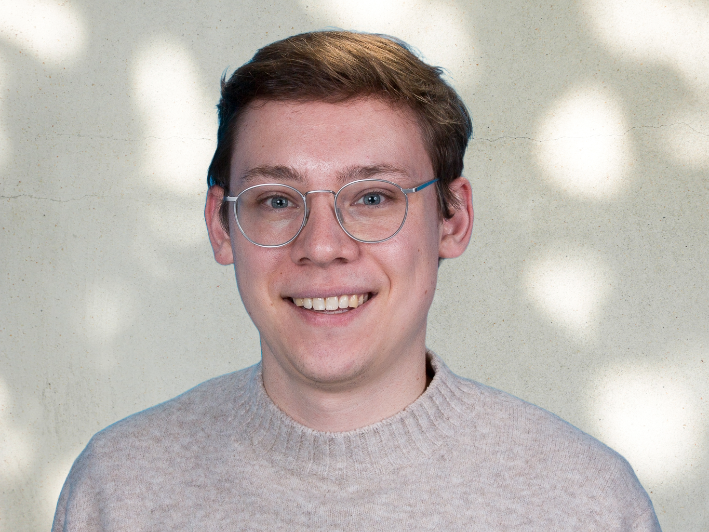

I am a PhD researcher in Machine Learning at the [Data Analytics cluster](https://www.ugent.be/eb/mio/en/research/dataanalytics) of the Faculty of Economics and Business Administration at Ghent University. I am a PhD fellow at the [Research Foundation - Flanders (FWO)](https://www.fwo.be/en/the-fwo/profile/) and I am also affiliated to the [CVAMO Flanders Make Lab](https://ugent-cvamo.github.io/).

My research focuses on **Natural Language Processing** and **Uncertainty Quantification** with neural networks. I am passionate about advancing Machine Learning applications through innovation and collaboration, employing my creative problem-solving and analytical skills to tackle complex challenges. 