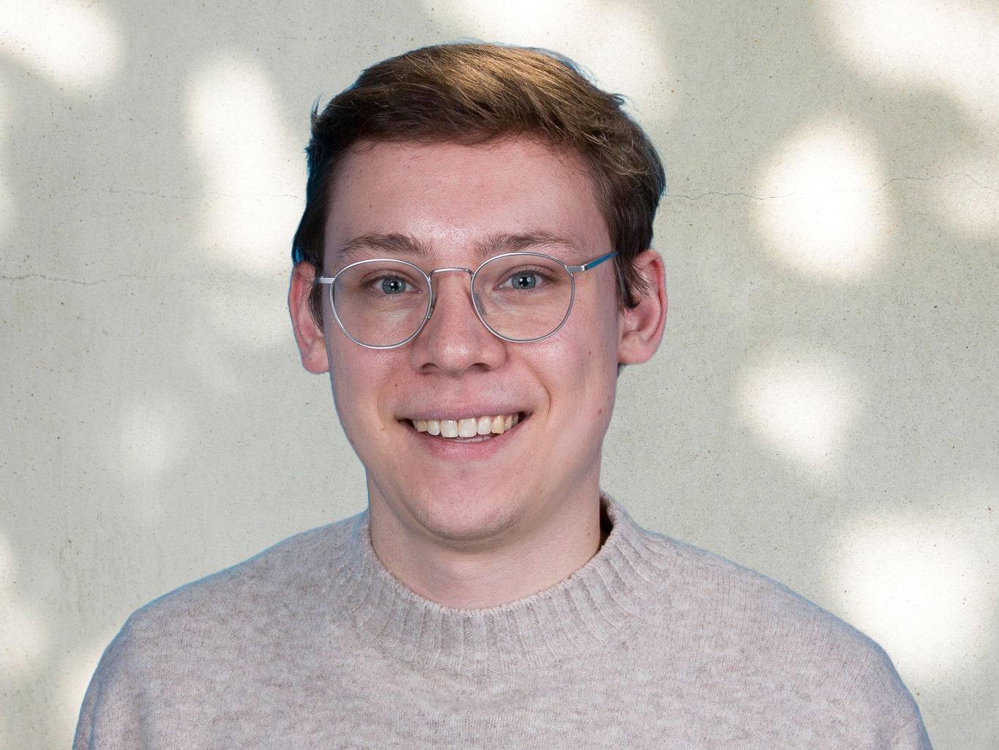

Arthur Thuy is a **Data Scientist** at **BNP Paribas Fortis**, working in the squad Personalized Communication. He obtained a **PhD in Machine Learning** from Ghent University, funded by FWO, focusing on Natural Language Processing and Uncertainty Quantification with neural networks. Before, Arthur graduated Summa Cum Laude in Business Engineering from Ghent University, earning the Sofico prize as the best student in the Data Analytics master’s program. He is passionate about advancing Machine Learning applications through innovation and collaboration, employing creative problem-solving and analytical skills to tackle complex challenges.